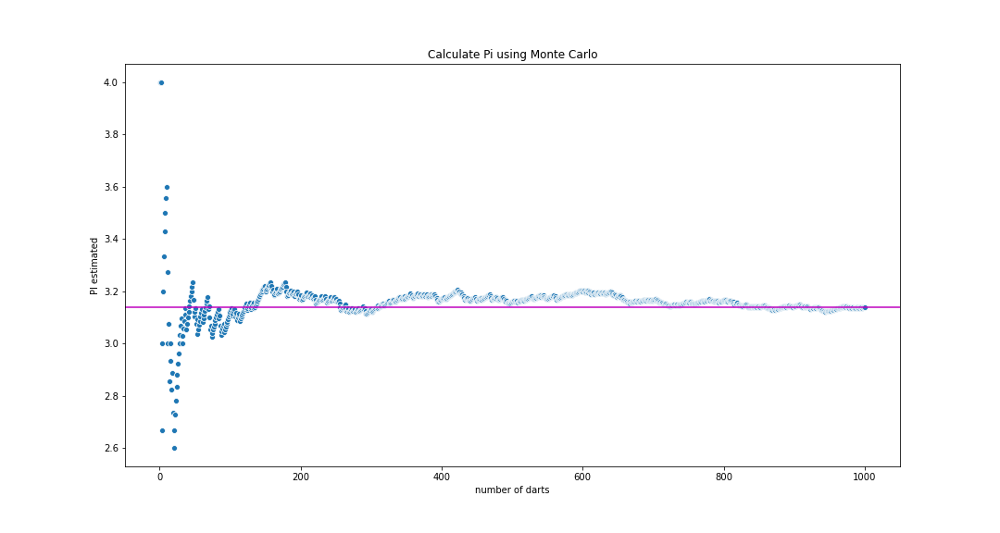

# Simulations using Python and Monte Carlo (random samples)
Calculate Pi by using Python simulations, following the tutorial from:  [junilearning](https://junilearning.com/blog/coding-projects/python-data-science-monte-carlo-simulations/)

Plot of estimated PI:

## Scenario
Imagine throwing darts on a squared dart board with a circle (radius circle = sidelength of square/2). All darts ending up in the circle are counted as "hits".

## Math
Pi can be approximated by diving the number of "hits" by the number of samples (= #darts thrown) and multiplying with factor 4.

This follows from p(hit) = hits / #darts thrown = circle area / square area = pi * r^2 / 4 * r^2.

Therefore: 4 * #darts in circle / #darts thrown = pi

## Approach
1. Simulate one dart by randomly generating x and y coordinates for dart.
2. Create Loop (using 1000 samples) and record data in dataframe.
3. Plot results.

## Result
Table containing all the sample throws:

<table border="1" class="dataframe">
  <thead>
    <tr style="text-align: right;">
      <th></th>
      <th>dart_number</th>
      <th>hit</th>
      <th>estimated_pi</th>
    </tr>
  </thead>
  <tbody>
    <tr>
      <th>0</th>
      <td>1</td>
      <td>1</td>
      <td>4.000000</td>
    </tr>
    <tr>
      <th>1</th>
      <td>2</td>
      <td>1</td>
      <td>4.000000</td>
    </tr>
    <tr>
      <th>2</th>
      <td>3</td>
      <td>0</td>
      <td>2.666667</td>
    </tr>
    <tr>
      <th>3</th>
      <td>4</td>
      <td>1</td>
      <td>3.000000</td>
    </tr>
    <tr>
      <th>4</th>
      <td>5</td>
      <td>1</td>
      <td>3.200000</td>
    </tr>
    <tr>
      <th>...</th>
      <td>...</td>
      <td>...</td>
      <td>...</td>
    </tr>
    <tr>
      <th>995</th>
      <td>996</td>
      <td>0</td>
      <td>3.136546</td>
    </tr>
    <tr>
      <th>996</th>
      <td>997</td>
      <td>1</td>
      <td>3.137412</td>
    </tr>
    <tr>
      <th>997</th>
      <td>998</td>
      <td>1</td>
      <td>3.138277</td>
    </tr>
    <tr>
      <th>998</th>
      <td>999</td>
      <td>1</td>
      <td>3.139139</td>
    </tr>
    <tr>
      <th>999</th>
      <td>1000</td>
      <td>1</td>
      <td>3.140000</td>
    </tr>
  </tbody>
</table>

1000 rows × 3 columns

