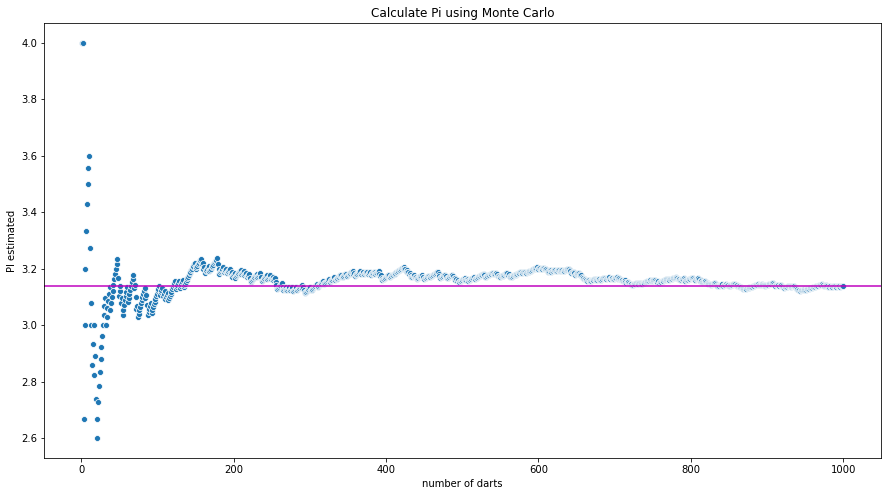

```python
import random
import math
import pandas as pd


# init
darts_thrown = 0
number_of_darts = 1000
radius = 0.5
dart_data = {'dart_number':[], 'hit':[], 'estimated_pi':[]}

# loop darts
while darts_thrown < number_of_darts:
    # random samples
    x = random.random() - 0.5
    y = random.random() - 0.5
    
    # measure distance to center
    x2 = x ** 2
    y2 = y ** 2
    distance = math.sqrt(x2 + y2)
    
    # test for hit
    if distance < radius:
        dart_data['hit'].append(1)
    else:
        dart_data['hit'].append(0)
    
    # collect statistics
    darts_thrown += 1
    dart_data['dart_number'].append(darts_thrown)
    dart_data['estimated_pi'].append(sum(dart_data['hit'])*4/darts_thrown) 

# create dataframe
dart_table = pd.DataFrame(data=dart_data)
dart_table
```


<div>
<style scoped>
    .dataframe tbody tr th:only-of-type {
        vertical-align: middle;
    }

    .dataframe tbody tr th {
        vertical-align: top;
    }

    .dataframe thead th {
        text-align: right;
    }
</style>
<table border="1" class="dataframe">
  <thead>
    <tr style="text-align: right;">
      <th></th>
      <th>dart_number</th>
      <th>hit</th>
      <th>estimated_pi</th>
    </tr>
  </thead>
  <tbody>
    <tr>
      <th>0</th>
      <td>1</td>
      <td>1</td>
      <td>4.000000</td>
    </tr>
    <tr>
      <th>1</th>
      <td>2</td>
      <td>1</td>
      <td>4.000000</td>
    </tr>
    <tr>
      <th>2</th>
      <td>3</td>
      <td>0</td>
      <td>2.666667</td>
    </tr>
    <tr>
      <th>3</th>
      <td>4</td>
      <td>1</td>
      <td>3.000000</td>
    </tr>
    <tr>
      <th>4</th>
      <td>5</td>
      <td>1</td>
      <td>3.200000</td>
    </tr>
    <tr>
      <th>...</th>
      <td>...</td>
      <td>...</td>
      <td>...</td>
    </tr>
    <tr>
      <th>995</th>
      <td>996</td>
      <td>0</td>
      <td>3.136546</td>
    </tr>
    <tr>
      <th>996</th>
      <td>997</td>
      <td>1</td>
      <td>3.137412</td>
    </tr>
    <tr>
      <th>997</th>
      <td>998</td>
      <td>1</td>
      <td>3.138277</td>
    </tr>
    <tr>
      <th>998</th>
      <td>999</td>
      <td>1</td>
      <td>3.139139</td>
    </tr>
    <tr>
      <th>999</th>
      <td>1000</td>
      <td>1</td>
      <td>3.140000</td>
    </tr>
  </tbody>
</table>
<p>1000 rows × 3 columns</p>
</div>


```python
import seaborn as sns
import matplotlib.pyplot as plt


plt.clf()
plt.figure(figsize=(15,8))
plot = sns.scatterplot(x="dart_number", y="estimated_pi", data=dart_table, marker='o')
plt.axhline(y=3.14, color='m')
plot.set(title="Calculate Pi using Monte Carlo", xlabel = "number of darts", ylabel="PI estimated")
plt.savefig('pi_plot.png')

```


    <Figure size 432x288 with 0 Axes>




